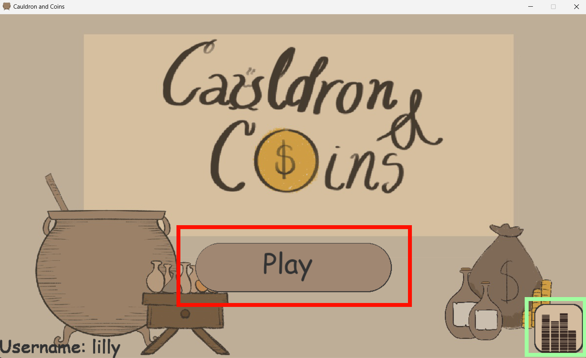
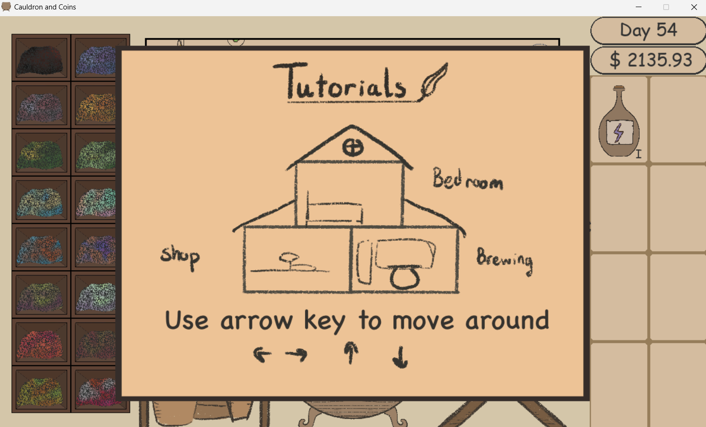
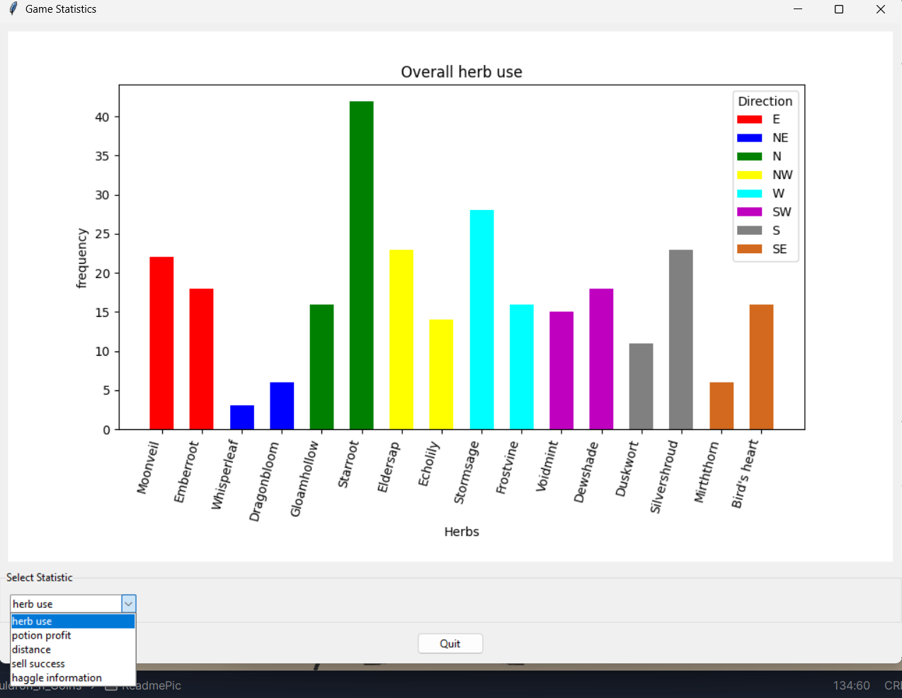

# Cauldron & Coins

# Table of Contents

- [Installation](#Installation)
- [A list of files and a brief description of classes it contains](#a-list-of-files-and-a-brief-description-of-classes-it-contains)
  - [Python file](#python-file)
    - [cnc_main.py](#cnc_mainpy)
    - [cnc_config.py](#cnc_configpy)
    - [cnc_draw.py](#cnc_drawpy)
    - [cnc_game.py](#cnc_gamepy)
    - [cnc_herbManager.py](#cnc_herbManagerpy)
    - [cnc_herbs.py](#cnc_herbspy)
    - [cnc_inventory.py](#cnc_inventorypy)
    - [cnc_map.py](#cnc_mappy)
    - [cnc_potion.py](#cnc_potionpy)
    - [dataCollecting.py](#datacollectingpy)
    - [datadisplay.py](#datadisplaypy)
  - [Folders](#folders)
    - [customer folder](#customer-folder)
    - [IngamePic folder](#ingamepic-folder)
    - [Music folder](#music-folder)
  - [Other Files](#other-files)
    - [6710545601 UML class.pdf](#6710545601-uml-classpdf)
    - [DESCRIPTION.md](#descriptionmd)
    - [LICENSE](#license-file)
    - [requirement.txt](#requirementtxt)
  - [Usage](#usage)
  - [Known Bugs](#known-bugs)


# Installation

1. Install all package and library
    ```bash
    pip install -r requirements.txt
    ```
  If there are problems with pygame installation, more instruction from the _[pygame website](https://www.pygame.org/wiki/GettingStarted)_

2. download or clone the project. (cloning using this command)
    ```bash
   git clone https://github.com/NattananPimj/Cauldron_n_Coins.git

3. run the _**[cnc_main.py](cnc_main.py)**_ or `python cnc_main.py`

4. insert your username then, enjoy

# A list of files and a brief description of classes it contains

## Python file
### [cnc_main.py](cnc_main.py)
This is the main part of the program, there is no class in here. 
Only the main run and music volume that user can change by their satisfaction

### [cnc_config.py](cnc_config.py)
file containing the game configuration, the stat of the potion and herbs.<br/>
#### Class Config:
containing the game configuration, the stat of the potion and herbs

### [cnc_draw.py](cnc_draw.py)
draw all interface
#### Class Drawer:
draw all the interface and asset, responsible for bedroom, restart popup, and tutorials

### [cnc_game.py](cnc_game.py)
contain and connect all class together
#### Class Game:
combine all the necessary method and call them, with the user event.

### [cnc_herbManager.py](cnc_herbManager.py)
store the interaction between herb and map
#### Class HerbCabinet:
create an object in class Herb and sent to class Map
#### Class HerbManager:
create and storing HerbCabinet for calling

### [cnc_herbs.py](cnc_herb.py)
#### Class Herb:
store the information about herb while create a path for brewing session

### [cnc_inventory.py](cnc_inventory.py)
#### Class ItemSlot:
store one item and display it on UI
#### Class Inventory: (Singleton)
store player data, load, and save player data
#### Class Haggling:
responsible for all haggling gameplay
#### Class Customer:
store request and all customer data
#### Class CustomerManager:
create customer and request, responsible for all shop system

### [cnc_map.py](cnc_map.py)
#### Class Map:
responsible for all brewing system, including create a Potion
#### Class Obstacle:
create the obstacle that will obstruct the brewing gameplay

### [cnc_potion.py](cnc_potion.py)
#### Class Potion:
store potion information

### [dataCollecting.py](dataCollecting.py)
#### Class DataCollector: (Singleton)
storing all the statistic data and save it to csv when the game is saved

### [datadisplay.py](datadisplay.py)
#### Class DataApp:
display all the data collected

## Folders

### [customer folder](customer)
containing all assets of customer

### [IngamePic folder](IngamePic)
containing all assets in game

### [ReadmePic folder](ReadmePic)
storing readme and information data

### [Music folder](Music)
containing game's background music with its license certificate

## Other files

### [6710545601 UML class.pdf](6710545601%20UML%20class.pdf)
UML class

### [DESCRIPTION.md](DESCRIPTION.md)
the details of the project

### [LICENSE file](LICENSE)
the project License

### [requirement.txt](requirements.txt)
requirement version of library and package

### [6710545601 Project Proposal4.pdf](6710545601%20Project%20Proposal%204.pdf)
original project proposal

# Usage
- When you start the program, you will see the title screen
  

- When you click play (red rectangle), you will go in the game with tutorials if your account is new.
You can press T again for tutorials


- When the green rectangle is click, the statistic are shown. choose the drop-down to show the data


# Known Bugs
- the water and spatula hitbox is collided. if you click at the curtain area, both will work at the same time
- the bottle can go out of bond
