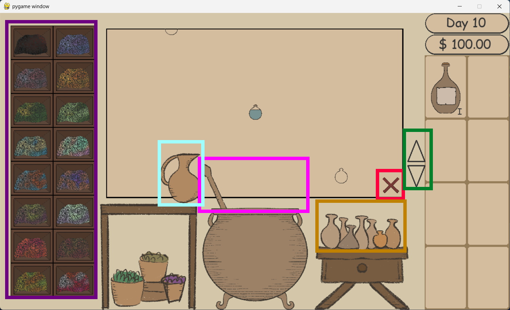

# Cauldron & Coins

### Note v0.5:
50% all the brewing system and inventory ready. Potion can not be sold yet

## Table of Contents

- [Instalation](#Instalation)
- [Tutorials](#Tutorials)
- [Known Bugs](#Knowns Bug v0.5)

# Instalation
1. download pygame, type in commands prompt

        pip install pygame
   
    or

        python -m pip install pygame
    or
    
        python3 -m pip install pygame

   or visit [pygame website](https://www.pygame.org/wiki/GettingStarted) to see the instalation 

3. after download pygame, download all the file, or clone this repo by using
   
    ```githubexpressionlanguage
   git clone https://github.com/NattananPimj/Cauldron_n_Coins.git
    ```
   
4. hit run on file **[cnc_main.py](cnc_main.py)**

Enjoy

# Tutorials (for v0.5)

this is brewing screen, the main part of game play (only section for v0.5)

Objective of the game is to brew the potion to sell. By adding path together to meet each shadow that 
give the different potion. The closer to the shadow, the more powerful potion created.

this game is most interact by mouse, in the picture there is the colored rectangle to show which area you can press

### mouse click control
* Purple rectangle:
  * press to get a herb, each cabinet have different herb and different path
  * hover to see which herb has which name(doesn't add yet) and which way it will lead
* Pink rectangle:
  * press to make the bottle move along path
* Cyan rectangle:
  * press to make the bottle go towards origin
* Orange rectangle:
  * press to make potion, can only make when the bottle hot the bottle shadow
* Red rectangle:
  * press to cancel brewing, reset to start
* Green rectangle:
  * press up and down to scroll around inventory slot

### keyboard + scroll wheel
* WASD: moving around the map
* Arrow Left, Arrow Right: move around shop scree and brewing screen(not done yet)
* Scroll Wheel: while hover on the inventory area, move up and down like the arrow


# Knowns Bug v0.5
- if hitting on very right of water jat and very left of cauldron, user can do both action at the same time.
- player can move around the map so far away and cannot come back easily
- while moving the map, cannot use mouse
- if hit spacebar, the water jar action will run (forgot to remove, will do in final)
